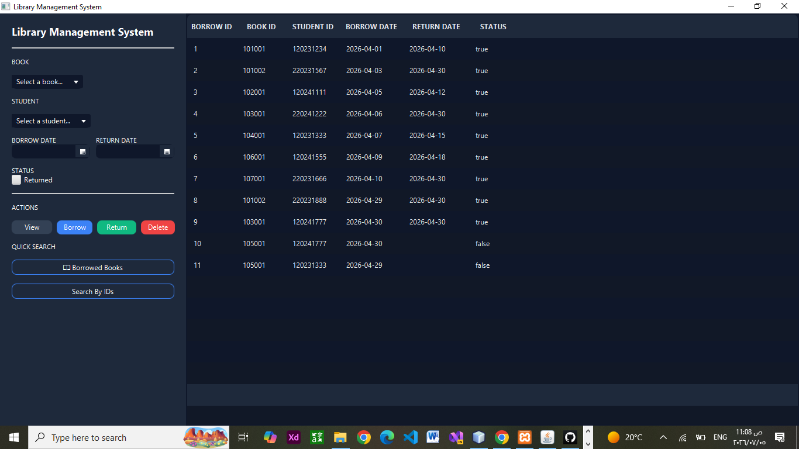

# 📚 Library Management System

## 📌 Overview

Library Management System is a JavaFX desktop application designed to help manage books and library operations through a simple and organized graphical user interface.

The system applies Object-Oriented Programming (OOP) concepts and focuses on clean structure and user-friendly interaction.

---

## 🎯 Features

* Add new books to the system
* Display and manage book information
* Organized graphical user interface using JavaFX
* Structured project architecture
* Apply OOP principles and clean code practices
* Interactive desktop-based experience
* Database connectivity using JDBC

---

## 🛠️ Technologies Used

* Java
* JavaFX
* JDBC
* OOP Concepts
* MVC Architecture
* NetBeans IDE
* Git & GitHub

---

## 🧱 Project Structure

```text
src/
│
├── models/
├── views/
├── controllers/
├── data/
└── app/
```

---
## 📸 Project Preview



---

## 💡 Concepts Applied

* Encapsulation
* Inheritance
* Polymorphism
* Abstraction
* MVC Architecture
* Event Handling
* GUI Design
* Database Management using JDBC

---

## 🚀 How to Run

1. Clone the repository:

```bash
git clone https://github.com/ManarAbuArab/LibraryManagementSystem.git
```

2. Open the project using NetBeans or any Java IDE.

3. Run the Main class.

---

## 👩‍💻 Author

**Manar Abu Arab**
---

## 🌟 Project Goal

The goal of this project is to practice building desktop applications using JavaFX while applying software engineering principles and improving GUI development skills.
